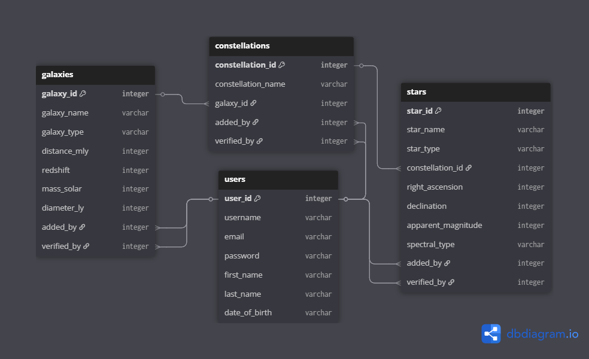
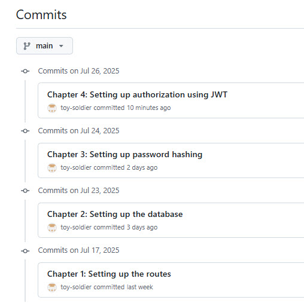

# starzz-gin

This is a REST API backend created using the Gin framework of Go.

### The Dataset

This project uses a database of fictional galaxies, constellations and stars.  

Here is a diagram to describe the tables and their relationships:

Stars are located in constellations, which are in turn located in galaxies.

The `galaxies`, `constellations` and `stars` tables contain the additional
fields `added_by` and `verified_by` to indicate the id of the users who made
the finding and verified it, respectively.

The database was created using SQLite.  The scripts to create the tables and
load the dummy data are included in `assets` for reference.  Note that the primary
keys of each table should actually increment automatically but are simply defined
as `INTEGER` and `PRIMARY KEY`, like so:

    CREATE TABLE users (
        user_id INTEGER,
        ...
        PRIMARY KEY (user_id)
    );
    
    CREATE TABLE galaxies (
        galaxy_id INTEGER,
        ...
        PRIMARY KEY (galaxy_id),
        ...
    );
    
    CREATE TABLE constellations (
        constellation_id INTEGER,
        ...
        PRIMARY KEY (constellation_id),
        ...
    );
    
    CREATE TABLE stars (
        star_id INTEGER,
        ...
        PRIMARY KEY (star_id),
        ...
    );

because in SQLite, if a column is defined as `INTEGER`
and `PRIMARY KEY`, there is no need to
define it as `AUTO_INCREMENT`.

### The Application

We setup our Go workspace first with `go mod init starzz-gin`.

All code committed at each chapter is available with the commit message of the chapter name.

#### Chapter 1: Setting up the routes

Go libraries added:

    gin

We set up the project structure as follows:

    assets           -> contains the application's assets
    main.go          -> the main module for the application
    |_ controllers   -> modules to handle application logic
    |_ routers       -> modules to handle application requests

The module `main.go` contains code to dispatch the requests to the application, to the modules
in `routers`:

    ...
    func main() {
        router := gin.Default()

        {
            constellations := router.Group("/constellations")
            constellations.GET("/", routers.HandleListConstellations)
            constellations.POST("/", routers.HandleRegisterConstellation)
            constellations.GET("/:id", routers.HandleGetConstellationByID)
            constellations.PUT("/:id", routers.HandleUpdateConstellationByID)
            constellations.DELETE("/:id", routers.HandleDeleteConstellationByID)
        }

        ...

        router.Run("localhost:8080")
    }
    ...

Notice that we assign the routes to groups, to emphasize that they are closely related.

A sample module in the `routers` package is `constellations.go`.  It contains the functions to
handle the requests to the `/constellations` endpoints:

    ...
    func HandleListConstellations(c *gin.Context) {
        statusCode, message := controllers.ListConstellations()
        c.JSON(statusCode, message)
    }

    func HandleRegisterConstellation(c *gin.Context) {
        var newData constellationData

        if err := c.BindJSON(&newData); err != nil {
            // if the conversion fails, this will automatically return HTTP 400
            // so there is no need to explicitly handle it
            return
        }

        statusCode, message := controllers.RegisterConstellation(&newData)
        c.JSON(statusCode, message)
    }
    ...

Note the `c.BindJSON(&newData)` statement.  It transforms the JSON data sent by the client as part of the request,
to a Go `struct` that is defined as:

    type constellationData struct {
        ConstellationID   int    `json:"constellation_id"`
        ConstellationName string `json:"constellation_name"`
        GalaxyID          int    `json:"galaxy_id"`
        AddedBy           int    `json:"added_by"`
        VerifiedBy        int    `json:"verified_by"`
    }

For example, the JSON data:

    {
        "constellation_id": 17,
        "constellation_name": "Orion",
        "galaxy_id": 54,
        "added_by": 100,
        "verified_by": 2
    }

is converted to:

    {
        ConstellationID: 17,
        ConstellationName: "Orion",
        GalaxyID: 54,
        AddedBy: 100,
        VerifiedBy: 2
    }

The different requests are then forwarded to different functions in `constellations.go` in the `controllers` package.

    ...
    func ListConstellations() (int, map[string]string) {
        return http.StatusOK, map[string]string{"message": "Successfully listed constellations."}
    }

    func RegisterConstellation(newData any) (int, map[string]any) {
        return http.StatusCreated, map[string]any{"message": "Successfully added constellation.", "data": newData}
    }
    ...

The other modules in the `routers` package follow a similar logic.

#### Chapter 2: Setting up the database

Go libraries added:

    sqlite

We add the `models` package to our project:

    assets           -> contains the application's assets
    main.go          -> the main module for the application
    |_ database      -> modules to handle database operations
    |_ controllers   -> modules to handle application logic
    |_ routers       -> modules to handle application requests

We refactor all the `struct`s we had previously defined in the modules of the package `routers`, to `commons.go`
of package `database`.  We also add `struct`s to print short, and detailed, JSON of database records (short versions
are displayed in "summary" views; detailed versions are displayed in "detail" views).  For example, for a `Constellation`
(one record in the `constellations` table) defined as:

    type Constellation struct {
        ConstellationID   int    `json:"constellation_id"`
        ConstellationName string `json:"constellation_name"`
        GalaxyID          int    `json:"galaxy_id"`
        AddedBy           int    `json:"added_by"`
        VerifiedBy        int    `json:"verified_by"`
    }

The short version is defined as

    type ConstellationShort struct {
        ConstellationID   int    `json:"constellation_id"`
        ConstellationName string `json:"constellation_name"`
    }

which for constellation 1, is displayed as

    {
        "constellation_id": 1,
        "constellation_name": "CON-YKkuk"
    }

The detailed version is defined as

    type ConstellationDetailed struct {
        ConstellationID   int         `json:"constellation_id"`
        ConstellationName string      `json:"constellation_name"`
        Galaxy            GalaxyShort `json:"galaxy"`
        AddedBy           UserShort   `json:"added_by"`
        VerifiedBy        UserShort   `json:"verified_by"`
    }

which for constellation 1, is displayed as

    {
        "constellation_id": 1,
        "constellation_name": "CON-YKkuk",
        "galaxy": {
            "galaxy_id": 1,
            "galaxy_name": "GAL-LPvfm"
        },
        "added_by": {
            "user_id": 10,
            "username": "slimeburner14288"
        },
        "verified_by": {
            "user_id": 37,
            "username": "centwhistle45939"
        }
    }

Notice that it includes short versions of the `Galaxy` and `User` associated with the `Constellation`.

Also in `commons.go` we add some code to connect to our database in `assets/db.sqlite3`:

    ...
    var DB *sql.DB

    func ConnectToDatabase() error {
        db, err := sql.Open("sqlite", "./assets/db.sqlite3")
        if err != nil {
            return err
        }

        DB = db
        return nil
    }

And in `main.go` we add some code to invoke the function whenever the appication is run:

    ...
    err := database.ConnectToDatabase()
    if err != nil {
        log.Fatal(err)
    }
    ...

In package `database` we create a new module for each database table we need to interface to.  Each
module contains code to perform the operations on the specific table.  For example, `constellations.go`
contains the code to interact with the `constellations` table:

    ...
    func ListConstellations() ([]ConstellationShort, error) {
        rows, err := DB.Query("SELECT constellation_id, constellation_name FROM constellations")
        if err != nil {
            return nil, err
        }
        defer rows.Close()

        listOfConstellations := make([]ConstellationShort, 0)

        for rows.Next() {
            record := ConstellationShort{}
            err = rows.Scan(&record.ConstellationID, &record.ConstellationName)
            if err != nil {
                return nil, err
            }
            listOfConstellations = append(listOfConstellations, record)
        }

        err = rows.Err()
        if err != nil {
            return nil, err
        }
        return listOfConstellations, nil
    }

    func RegisterConstellation(newData Constellation) (int64, error) {
        stmt, err := DB.Prepare("INSERT INTO constellations(constellation_name, galaxy_id, added_by, verified_by) VALUES(?,?,?,?)")
        if err != nil {
            return 0, err
        }
        var result sql.Result
        result, err = stmt.Exec(newData.ConstellationName, newData.GalaxyID, newData.AddedBy, newData.VerifiedBy)
        if err != nil {
            return 0, err
        }

        return result.LastInsertId()
    }
    ...

We then modify `constellations.go`in package `controllers` to call the appropriate function in `constellations.go`
of package `database`:

    ...
    func getConstellationError(err error) (int, map[string]any) {
        errorCode := http.StatusInternalServerError
        errorMessage := err.Error()
        if errorMessage == "Constellation not found" {
            errorCode = http.StatusNotFound
        }
        return errorCode, map[string]any{"message": errorMessage}
    }

    func ListConstellations() (int, any) {
        listing, err := database.ListConstellations()
        if err != nil {
            return getConstellationError(err)
        }
        return http.StatusOK, listing
    }

    func RegisterConstellation(newData database.Constellation) (int, map[string]any) {
        newRecordId, err := database.RegisterConstellation(newData)
        if err != nil {
            return getConstellationError(err)
        }
        newData.ConstellationID = int(newRecordId)
        return http.StatusCreated, map[string]any{"message": "Successfully added constellation.", "data": newData}
    }
    ...

The other modules in the `database` and `cntrollers` packages are similarly written.

### References

Please refer to the documentations for more information.

- Gin documentation at <https://gin-gonic.com/en/docs/>
- SQLite (for Go) documentation at <https://pkg.go.dev/modernc.org/sqlite>
